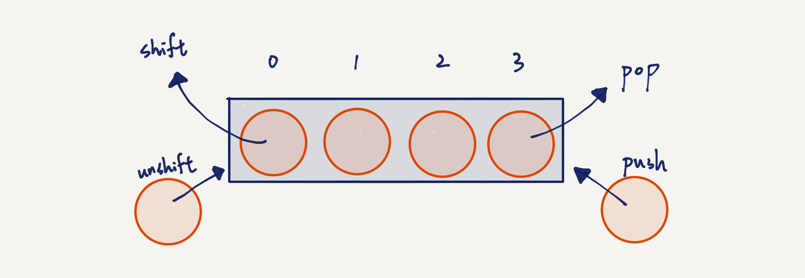

# 陣列

前一張在介紹迴圈時，提到一些例子，例如我有一百件褲子，要一件一件檢查。或是老師巡邏學校有好幾個班級。我們知道可以用迴圈的方式，一個一個把「東西」數過一遍，也就是遍歷一次，但迴圈是「方法」，我們必須準備好東西，才能使用方法。

這邊的東西就是指一百件褲子或是 20 個班級。我們需要用一個容器來儲存這些東西，在 JS 中，這個容器可以是陣列（Array），我們可以把一百件褲子放入陣列，那他就會叫做褲子陣列。

事實上可以存一堆物品的容器可以是其他東西，但我們晚點再介紹。這個章節中我們要介紹何謂陣列。

## 定義

這邊先定義陣列：讓東西以連續的方式放入長條形容器。

就像下面這張圖一樣：

糖果盒： 

在這個例子中，我們有好多顆糖果，然後我們把糖果一顆一顆放進長條形盒子裡，這個概念就是陣列了！

JS 的陣列可以放入任何東西，而且可以是不同東西。例如陣列可以混雜放入數字、字母、物件（Object）甚至是函數（function）。

雖然說可以混雜放入不一樣東西，但是我們習慣上會讓陣列放入同一種物品，例如全部都是數字，全部都是字串。這是因為在 C++、Java 等語言中，陣列只能是同型別的物件，你必須在使用陣列前就先跟程式說好這個陣列只會裝什麼。所以 JS 可以隨便放其實是一種雙面刃，有很大彈性，也有很大的風險。

要注意的是，陣列的每個元素都會有編號，編號會從 0 開始數起，依序往後加一。像這邊有四顆糖果，所以糖果編號是 0、1、2、3。之後我們要呼叫特定糖果時，就會需要這個編號。

## JS 語法

### 建立陣列

如果我們想要定義一個陣列，我們可以這樣宣告：

```js
let primes = [2, 3, 5, 7, 11, 13, 17];
```

這邊我把質數放入陣列中，我們觀察到陣列的語法是：

```js
let 某陣列 = [元素0, 元素1, 元素2, ... ];
```

### 呼叫元素

!FILENAME ex1.js

```js
const primes = [2, 3, 5, 7, 11, 13, 17];
console.log(primes);
console.log(typeof primes);
console.log(primes[0])
console.log(primes[1])
```

執行 `ex1.js`：

```log
$ node ex1.js
[ 2, 3, 5, 7, 11, 13, 17 ]
object
2
3
```

- 第一行我們先印出原本的陣列，發現跟原本一樣（不是廢話？XD）其實是跟大家說以後要 debug 時可以直接印出來看。
- 第二行我們檢查 `primes` 的型別，發現竟然是 `object`（物件），非常神奇！這其實是因為陣列在 JS 中被歸類成「特殊的」物件。不過我們心中要知道他就是陣列。
- 第三行我呼叫了 `primes[0]`，這是取得 `primes` 陣列中第 0 個元素的意思。因為編號是從左數到右，所以編號 0 的元素就是 `2`。
- 第四行我呼叫了 `primes[1]`，所以從左第二個元素 `3` 會被印出來。

所以我們知道如果想要存取陣列的某個元素，我們可以用 `陣列名稱[編號]` 來取得那個物件。

### 修改陣列

我們知道可以用 `陣列名稱[編號]` 來取得特定元素，我們除了可以去讀他的值，當然也可以修改他。

!FILENAME ex2.js

```js
const names = ["Jenny", "Tiger", "Leo"];
console.log(names);

names[0] = "Lucy";
console.log(names);
```

執行 `ex2.js`：

```log
$ node ex2.js
[ 'Jenny', 'Tiger', 'Leo' ]
[ 'Lucy', 'Tiger', 'Leo' ]
```

我們先印出原本的陣列，然後修改第 0 個元素，再印出一次，發現元素的確被更換了！

當然我們也可以直接把原本陣列換掉。

!FILENAME ex3.js

```js
let names = ["Jenny", "Tiger", "Leo"];
console.log(names);

names = ["Cat", "Dog"];
console.log(names);
```

執行 `ex3.js`：

```log
$ node ex2.js
[ 'Jenny', 'Tiger', 'Leo' ]
[ 'Cat', 'Dog' ]
```

陣列就直接被替換掉了。

這邊要注意，我們之前有提到 `const` 定義不變的變數，`let` 定義會變的變數。在陣列中，除非你把**整個陣列換成另一個陣列**，不然視為不變。換句話說，`let` 才能對整個陣列本身做改動，不然用 `const` 就可以了。

舉個例子說明：

```js
const names = ["Jenny", "Tiger", "Leo"];
names = ["Cat", "Dog"]; // 錯誤，不可直接將 const 的陣列替換成另一個陣列
names[0] = ["Meow"]; // 可以，因為對元素操作，不算改變陣列本身
```

### 混搭

剛剛提過，JS 中的陣列很特別，可以放入各種東西混在一起。

```js
const names = ["Jenny", true, 3444, 6.7];
```

### 陣列與迴圈

我們在提迴圈的時候，常常在數東西，那時候我們只能針對數字來數，比方說從 0 數到 100。現在我們認識陣列之後，我們可以對陣列的元素來一個一個數。

舉例來說，假設一群小孩の年紀是：

```js
const children = [12, 14, 12, 16, 13, 8, 9];
```

現在老師要帶這群孩子去動物園玩，而 12 歲以下的小朋友只要半價，否則叫要買全票。

那麼入口檢票機的程式就會這樣寫：

!FILENAME ex4.js

```js
const children = [12, 14, 12, 16, 13, 8, 9];

for(let i = 0; i< children.length; i++) {
    if(children[i] <= 12) {
        console.log(`第 ${i} 個小朋友：半票`);
    } else {
        console.log(`第 ${i} 個小朋友：全票`);
    }
}
```

執行 `ex4.js`：

```log
$ node ex5.js
第 0 個小朋友：半票
第 1 個小朋友：全票
第 2 個小朋友：半票
第 3 個小朋友：全票
第 4 個小朋友：全票
第 5 個小朋友：半票
第 6 個小朋友：半票
```

`children.length` 是取得陣列長度的意思，因為陣列是從 0 開始數，所以條件是 `i < 長度`，仔細想想就會知道，現在這個例子小孩有 7 個，所以我們是 0～6，因此條件這樣設正確無誤。

當我們單存只是想要重複跑好多遍的時候，初始值跟條件邊界可以隨便設定，只要數量依樣就好。例如 0～5 和 10～15 數量都一樣，假設我們只是想印出好多個「我愛你」，這樣的情況下就沒差。

但是如果是針對陣列在列舉，因為陣列必定從 0 開始排起，假設你要把整個陣列都數一遍，記住一定要從 0 開始，並且陣列的最後一個元素的編號是 `array.length - 1`。

### 陣列複製

這邊介紹怎樣複製一個陣列。

我們知道要複製一個變數，只要用 `=` 就好，例如：

```js
const a = 5;
const b = a;  // b = 5
```

所以陣列我們也如法炮製：

```js
const arr1 = [1, 2, 3];
const arr2 = arr1;

arr1[0] = 100;     // 改動 arr1 第 0 元素
console.log(arr1); // [100, 2, 3]
console.log(arr2); // [100, 2, 3]
```

大家可以跑跑看，會覺得很神奇 XD

我們先複製 `arr1` 給 `arr2`，然後改了 `arr1` 第 0 個元素，結果 `arr2` 的第 0 個元素也被改了。

這是因為直接複製陣列的話，只是把陣列的記憶體位置複製而已。

白話一點來舉例的話，*安齊*是我的名字。這個情境下，當別人提到*安齊*就是指向我，而「真正的我」是記憶體的其中一個區塊，那個區塊紀錄了我的資訊。

*安齊*這個名稱只是記憶體位置，讓別人知道要這塊記憶體的名字是什麼。所以*安齊*只是個用來指「我這個人」的地址，當你複製了一份*安齊*，*複製的安齊*一樣還是指向我這個人。

所以 `arr1` 和 `arr2` 直接用 `=` 來複製的話，只是把地址複製一次，其實兩個陣列指向的實際記憶體內容是一樣的，所以任何改動都是連通的。

好吧！那我們該怎麼做呢？

#### 方法一

比較笨的做法：

```js
const arr1 = [1, 2, 3];
const arr2 = [];

for(let i = 0; i < arr1.length; i++) {
    arr2[i] = arr1[i];
}
```

我們直接用迴圈一個一個複製，因為單一變數複製時，記憶體會是不一樣的。`arr2` 原本是空的，我們直接對 `arr2[i]` 位置操作，可以直接讓沒有元素的位置有東西。

要注意的是，如果陣列原本是空的 `[]`，直接在編號 `i` 位置插入值的話，陣列就會變成長度 `i`，中間會是 `undefined`。

例如：

```js
const arr = [];

arr[3] = 5;

// arr = [undefined, undefined, undefined, 5]
```

請小心，這種操作方式也是 JS 的特色之一，其他語言通常不能這樣做。

#### 方法二

另一種是簡單明瞭的方法，為 JS 的內建語法。

```js
const arr1 = [1, 2, 3];
const arr2 = [...arr1];

arr1[0] = 40;
console.log(arr2[0]); // 1，並沒有因為 arr1 改了 而改變
```

`...array` 是直接複製目標 `array` 的語法。

也可以這樣用：

```js
const arr1 = [1, 2, 3];
const arr2 = [5, ...arr1, 6];
console.log(arr2); // [5, 1, 2, 3, 6]
```

### 陣列操作

假設今天班上有 40 個學生，今天來了一個轉學生。我們會把原本班級打散，重新組一個班級嗎？當然不會。我們只要多準備一套桌椅給他就好。

所以假設今天有陣列：

```js
const numbers = [1, 2, 3];
```

如果今天我想加一個元素進陣列，我們也不必重新定義陣列，只要插入元素即可。同理，我們也可以直接移除一個元素。

!FILENAME ex5.js

```js
const names = ["A", "B"];
console.log(names); // 列印原本

names.push("D"); // 向後插入
console.log(names);

names.pop();  // 移除最後面一個
console.log(names);

names.shift(); // 移除最前面一個
console.log(names);

names.unshift("K"); // 從前插入
console.log(names);
```

執行 `ex5.js`：

```log
$ node ex2.js
[ 'A', 'B' ]       // 原本的
[ 'A', 'B', 'D' ]  // 後面加入 D 後
[ 'A', 'B' ]       // 移除最後面的元素後
[ 'B' ]            // 移除最前面的元素後
[ 'K', 'B' ]       // 在最前面插入 K 後
```

- `push(元素)` 是把元素插入陣列最後面的方法
- `pop()` 會把陣列中最後一個元素移除
- `shift()` 會把陣列中最前面一個元素移除
- `unshift(元素)` 是把元素插入到陣列最前面的方法

如圖所示：

在這幾個方式操作下，陣列本身並沒有改變，如同我剛剛形容班級，班級並不會因為一個學生轉走轉入而必須打散重組，所以我們可以用 `const` 定義陣列，並增加和移除元素。

那假設我們今天想要在陣列**中間**插入新的值或是刪掉某個元素呢？

我們可以透過 `array.slice(from, to)` 語法，會擷取新的陣列出來（不影響原本陣列）。其中擷取的陣列會包含 `from` 那個位置，不包含 `to` 那個位置，之間的所有元素。

```js
const origin = [1, 2, 3, 4, 5, 6, 7];
         // 編號 0  1  2  3  4  5  6  7

const part1 = origin.slice(0, 4); // 擷取 origin 編號 0 到 4 間的元素
                                  // 1, 2, 3, 4 (不包含編號 4，所以沒 5)

const part2 = origin.slice(5, 6); // 擷取 origin 編號 5 到 7 間的元素
                                  // 6, 7

const newArr = [...part1, 44, 55, ...part2];

console.log(newArr);
// [ 1, 2, 3, 4, 44, 55, 6, 7]
```

## 警告

!FILENAME ex6.js

```js
const children = [12, 14, 12, 16, 13, 8, 9];

for(let i = 0; i< children.length; i++) {
    children.push(10);
}

console.log("程式結束"); // 不會跑到，因為在這之前程式會掛掉
```

`ex6.js` 是一隻很危險的程式，最糟情況下有可能讓系統崩潰。

執行 `ex6.js`：

```log
$ node ex6.js

FATAL ERROR: invalid array length Allocation failed - JavaScript heap out of memory
 1: node::Abort() [/usr/local/bin/node]
 2: node::FatalException(v8::Isolate*, v8::Local<v8::Value>, v8::Local<v8::Message>) [/usr/local/bin/node]
 3: v8::internal::V8::FatalProcessOutOfMemory(char const*, bool) [/usr/local/bin/node]
 4: v8::internal::Heap::AllocateFixedArrayWithFiller(int, v8::internal::PretenureFlag, v8::internal::Object*) [/usr/local/bin/node]
 5: v8::internal::Factory::NewUninitializedFixedArray(int) [/usr/local/bin/node]
 6: v8::internal::(anonymous namespace)::ElementsAccessorBase<v8::internal::(anonymous namespace)::FastPackedSmiElementsAccessor, v8::internal::(anonymous namespace)::ElementsKindTraits<(v8::internal::ElementsKind)0> >::GrowCapacity(v8::internal::Handle<v8::internal::JSObject>, unsigned int) [/usr/local/bin/node]
 7: v8::internal::Runtime_GrowArrayElements(int, v8::internal::Object**, v8::internal::Isolate*) [/usr/local/bin/node]
 8: 0x39e257c842fd
 9: 0x39e257e0caf3
```

我們看到了錯誤訊息 `FATAL ERROR: invalid array length Allocation failed - JavaScript heap out of memory`。意思是說你的陣列把記憶體塞爆了！！

為什麼會發生這種事情呢？

因為我們在數陣列的時後，同時也在往陣列後面加元素。

想像個例子，韓信點兵一秒中可以點一個人，假設原本列隊的士兵有十個，那麼十秒後就能檢閱完畢。但是今天當韓信每次數完一個人的時候，又一個士兵加進來。數一個卻又多一個，如此沒完沒了，韓信永遠沒有數完的時候。

在程式中也是如此，我們把條件設為 `i < array.length`，但當 `i` 加一的時候，陣列長度也跟著加一，因此程式會一直數下去，陣列也會越加越長，加到最後陣列把記憶體灌爆了，然後程式就掛了。

所以我們在寫程式的時候要小心，要避免犯下這種使程式永遠停不下來的情況。

## 小結

本篇介紹陣列的概念，陣列可以有排列性的儲存很多元素，並可以隨意改變裡面的元素，或是在陣列前面後面放入新的元素，或是刪除元素。陣列是非常常使用的資料儲存方式，並且通常會搭配迴圈來做列舉，並對每個元素操作。
