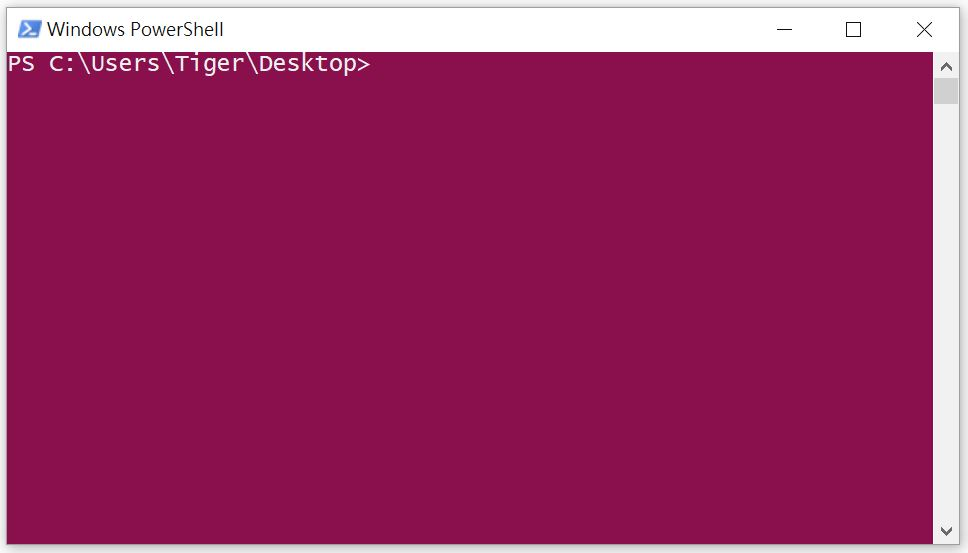
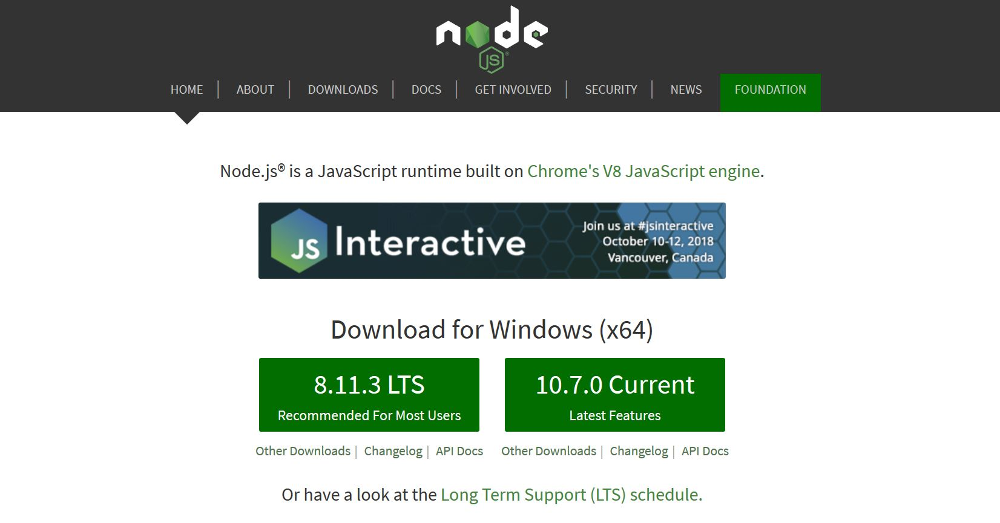

# 環境建設與執行第一個程式

JS 可以當作獨立的程式直接運行，也可以跑在網頁上。本篇先介紹如何直接運行 JS 就好，因為要跑在網頁上，我們必須寫一份網頁出來，其中概念不只 JS，還必須懂 HTML，但這邊我們先了解 JS 就好，所以跑在網站上的方式待晚點再作介紹。

### 開啟終端機

終端機(Terminal)或是命令提示字元是用來輸入指令來呼叫程式的地方。

在 Linux 或 Mac 上只要搜尋 Terminal 就可以找到。

Windows 的話可以左下角搜尋 cmd 便可以找到命令提示字元。或是按住 shift + 滑鼠右鍵，出現的選單中也會有命令提示字元這個選項。在比較新版的 Windows 10 中，命令提示字元會被 PowerShell 取代，但其實用途差不多。

不管是哪個作業系統打開後都會長得差不多，這邊用 PowerShell 為例：



## 環境建設

首先請確認你的電腦裡面有裝 Firefox 或是 Chrome。

再來我們要裝 NodeJS，這是可以讓 JS 可以當作獨立程式跑的軟體。

### NodeJS 安裝

#### Windows & macOS

如果你是使用 Windows 或是 macOS 的話，步驟非常簡單，只要到 [NodeJS](https://nodejs.org/en/) 官網點 LTS(長期維護版) 或是 Current(最新版) 就可以下載。兩者皆可，在我們現階段學習並無差別。



接著會下載安裝執行檔，就照著安裝步驟一步一步走就可以順利安裝。

#### Linux

如果你是用 Linux 的話，最簡單作法是先裝 [NVM](https://github.com/creationix/nvm)，再從 NVM 裝 NodeJS。步驟如下：

下載安裝 NVM

```sh
wget -qO- https://raw.githubusercontent.com/creationix/nvm/v0.33.11/install.sh | bash
```

確認 `~/.bashrc` 中有把路徑設定進去

```sh
export NVM_DIR="$HOME/.nvm"
[ -s "$NVM_DIR/nvm.sh" ] && \. "$NVM_DIR/nvm.sh" # This loads nvm
```

安裝 NodeJS

```sh
nvm install node
```

### 檢查 NodeJS

不管你是哪個作業系統，安裝完後打開終端機輸入：

```
node -v 
```

有出現版本資訊就代表你安裝成功了！

```log
PS C:\Users\Tiger\Desktop> node -v
v8.11.2
```

### 你的第一支程式

開啟你慣用的文字編輯器，Windows 的話可以直接用`記事本`，macOS 可以用`文字編輯`。不過我推薦大家使用 [VSCode](https://code.visualstudio.com/) 這款編輯器，他在各個作業系統都可以使用。他的好處是他會將程式碼上色，比較好閱讀，此外它可以增加很多擴充功能，例如語法驗證、自動推薦語法、檢查排版等等。

在你的桌面建立一個檔案叫做 `hello.js`，並在裡面輸入下面這行：

!FILENAME hello.js

```js
console.log("Hello World!");
```

打開終端機，注意終端機上的路徑要和檔案放的位置同一層，剛剛我們是在桌面建立檔案，在 Windows 下直接在桌面點右鍵開啟終端機，路徑就會是在桌面了。 macOS 或 linux 預設路徑是家目錄，打開終端機後，可以 `cd ~/Desktop` 進入桌面目錄。

接著執行：

```sh
node hello.js
```

你就會看到

```log
PS C:\Users\Tiger\Desktop> node hello.js
Hello World!
```

你已經成功寫了一個簡單的程式碼，並印出在終端機上，這就是我們的第一支程式了！
